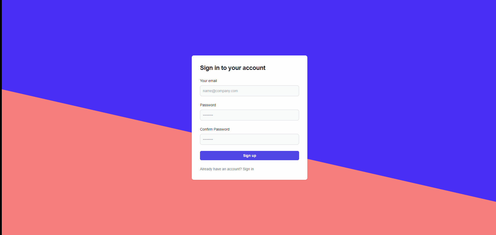

# Todo React App

Welcome to the Todo React App repository! This project provides a user-friendly web interface for managing tasks and todos. The app allows users to organize their tasks, mark them as completed, and stay on top of their to-do lists.



## Demo

Check out the live demo of the Todo React App: [Demo Link](https://todo-client-12.netlify.app/)<br/>
Demo User,<br/>
Email : user@test.com<br/>
Password : 123456<br/>


## Features


- Add tasks with titles and descriptions.
- Mark tasks as completed.
- Clean and intuitive user interface.
- Responsive design for various screen sizes.

## Prerequisites

- Node.js (v14 or higher)
- npm (Node Package Manager)
## Installation

Clone the repository:
```bash
git clone https://github.com/ad1tyaSharma/todo-api.git
cd todo-api
```
Install the dependencies:
```bash
npm install
```

    
## Usage
Run the development server:
```bash
npm run dev
```
Open your browser and navigate to `http://localhost:3000`.


## Contributing

Contributions are welcome! If you find any issues or want to enhance the app, feel free to open a pull request. Make sure to follow the existing coding style and add appropriate tests for your changes.

1. Fork the repository.
2. Create a new branch.
2. Make your changes and commit them.
4. Push the changes to your fork.
5. Open a pull request explaining your changes.
